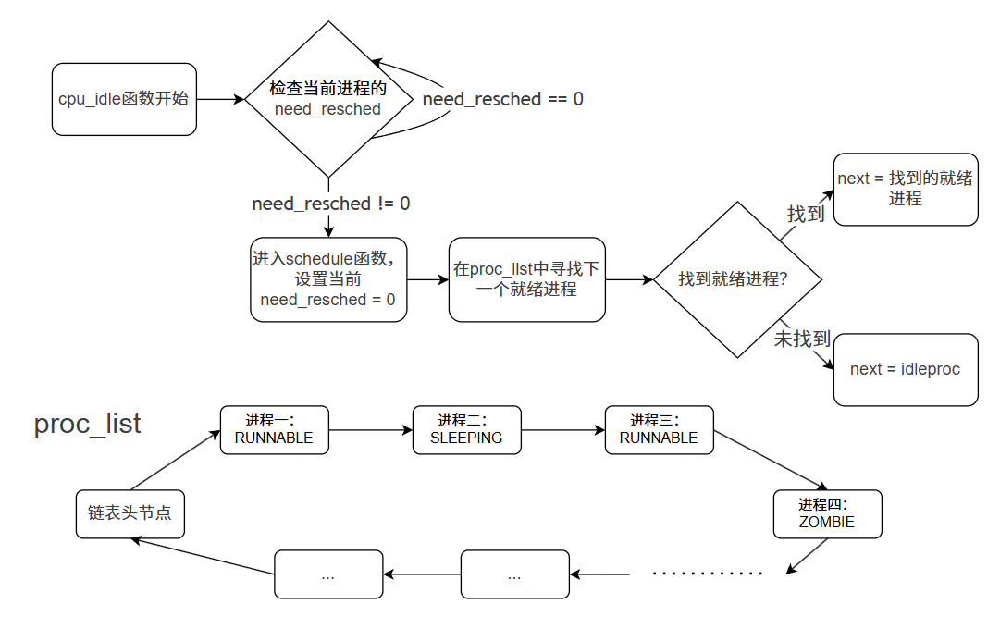

#### 调度并执行内核线程 initproc

在 uCore 执行完 `proc_init` 函数后，就创建好了两个内核线程：`idleproc` 和 `initproc`。此时，uCore 当前的执行现场就是 `idleproc`。当执行到 `init` 函数的最后一个函数 `cpu_idle` 之前，uCore 的所有初始化工作就已经完成了。`idleproc` 将通过执行 `cpu_idle` 函数主动让出 CPU，让其他内核线程得以执行，具体过程如下：

```c
void
cpu_idle(void) {
    while (1) {
        if (current->need_resched) {
            schedule();
            ...
```

首先，判断当前内核线程 `idleproc` 的 `need_resched` 是否不为 0。回顾前面“创建第一个内核线程 `idleproc`”的描述，`proc_init` 函数在初始化 `idleproc` 时就把 `idleproc->need_resched` 置为 1，因此会马上调用 `schedule()` 函数去寻找其他处于“就绪态”（即 `PROC_RUNNABLE`）的进程执行。

> **须知：uCore 中的进程状态**
>
> 在 uCore 操作系统中，进程在其生命周期中会经历四种基本状态：
>
> * **PROC_UNINIT（未初始化）**：进程控制块刚被创建，尚未完成初始化
> * **PROC_RUNNABLE（就绪/运行）**：进程已准备好运行，可能正在等待 CPU 或正在 CPU 上执行
> * **PROC_SLEEPING（睡眠/阻塞）**：进程因等待某个事件或资源而暂时无法执行
> * **PROC_ZOMBIE（僵尸）**：进程已执行完毕，等待父进程回收其资源
>
> 在 `schedule` 函数中，只有处于 `PROC_RUNNABLE` 状态的进程才会被选中执行。进程状态的切换将在后续章节详细介绍。

进程调度是多线程系统并发执行的基础。调度器通过一定的调度算法，在特定的调度点上触发调度，最终完成进程切换。其核心思想是：在调度点到达时，从可运行线程（`PROC_RUNNABLE`）中选择一个线程，并通过 `switch_to` 完成上下文切换。

在实验四中，调度点唯一位于 `cpu_idle` 函数中。当 `idleproc` 发现 `need_resched == 1` 时，会调用 `schedule()` 来触发调度。

uCore 在这里实现的时一个最简单的 FIFO 调度器。`schedule()` 的执行逻辑可以概括为以下几步：

1. 将当前内核线程 `current->need_resched` 置为 0。
2. 在 `proc_list` 链表中查找下一个处于 `PROC_RUNNABLE` 状态的线程或进程 `next`。
3. 找到合适的进程后，调用 `proc_run()` 函数，保存当前进程`current`的执行现场（进程上下文），恢复新进程的执行现场，完成进程切换。



其中，在 `proc_list` 中查找下一个就绪进程时，会有三种情况：

1. **当前进程不是 `idleproc`**：从当前进程的下一个位置开始查找，实现 Round-Robin 轮转调度。
2. **当前进程是 `idleproc`**：从链表头开始查找，给所有进程平等机会。
3. **找不到就绪进程**：遍历整个链表都没找到，则最后使用 `idleproc` 保底。

至此，找到下一个就绪进程后，新的进程 `next` 就开始执行了。由于 `proc_list` 中当前只有两个内核线程，而 `idleproc` 需要让出 CPU 给 `initproc`。我们可以看到 `schedule()` 通过查找`proc_list` 进程队列，只会找到一个处于“就绪”态的 `initproc` 内核进程，并调用 `proc_run()`，最终通过 `switch_to` 完成两个执行现场的切换。具体流程如下：

1. 将当前运行的进程设置为要切换过去的进程。
2. 将页表切换到新进程的页表。
3. 使用 `switch_to` 切换到新进程的上下文。

`switch_to` 函数（位于 `switch.S`）会保存前一个进程的寄存器上下文，恢复新进程的上下文，从而完成真正的 CPU 上的切换。函数参数是前一个进程和后一个进程的执行现场：process context。在上一节“设计进程控制块”中，描述了`context`结构包含的要保存和恢复的寄存器。我们再看看`switch_to`函数的执行流程：

```assembly
.text
# void switch_to(struct proc_struct* from, struct proc_struct* to)
.globl switch_to
switch_to:
    # save from's registers
    STORE ra, 0*REGBYTES(a0)
    STORE sp, 1*REGBYTES(a0)
    STORE s0, 2*REGBYTES(a0)
    STORE s1, 3*REGBYTES(a0)
    STORE s2, 4*REGBYTES(a0)
    STORE s3, 5*REGBYTES(a0)
    STORE s4, 6*REGBYTES(a0)
    STORE s5, 7*REGBYTES(a0)
    STORE s6, 8*REGBYTES(a0)
    STORE s7, 9*REGBYTES(a0)
    STORE s8, 10*REGBYTES(a0)
    STORE s9, 11*REGBYTES(a0)
    STORE s10, 12*REGBYTES(a0)
    STORE s11, 13*REGBYTES(a0)

    # restore to's registers
    LOAD ra, 0*REGBYTES(a1)
    LOAD sp, 1*REGBYTES(a1)
    LOAD s0, 2*REGBYTES(a1)
    LOAD s1, 3*REGBYTES(a1)
    LOAD s2, 4*REGBYTES(a1)
    LOAD s3, 5*REGBYTES(a1)
    LOAD s4, 6*REGBYTES(a1)
    LOAD s5, 7*REGBYTES(a1)
    LOAD s6, 8*REGBYTES(a1)
    LOAD s7, 9*REGBYTES(a1)
    LOAD s8, 10*REGBYTES(a1)
    LOAD s9, 11*REGBYTES(a1)
    LOAD s10, 12*REGBYTES(a1)
    LOAD s11, 13*REGBYTES(a1)

    ret
```

可以看出来这段代码就是将需要保存的寄存器进行保存和调换。其中的a0和a1是RISC-V 架构中通用寄存器，它们用于传递参数，也就是说a0指向原进程，a1指向目的进程。

在之前我们也已经谈到过了，这里只需要调换被调用者保存寄存器即可。由于我们在初始化时把上下文的`ra`寄存器设定成了`forkret`函数的入口，所以这里会返回到`forkret`函数。`forkrets`函数很短，位于kern/trap/trapentry.S：

```assembly
    .globl forkrets
forkrets:
    # set stack to this new process's trapframe
    move sp, a0
    j __trapret
```

这里把传进来的参数，也就是进程的中断帧放在了`sp`，这样在`__trapret`中就可以直接从中断帧里面恢复所有的寄存器啦！我们在初始化的时候对于中断帧做了一点手脚，`epc`寄存器指向的是`kernel_thread_entry`，`s0`寄存器里放的是新进程要执行的函数，`s1`寄存器里放的是传给函数的参数。在`kernel_thread_entry`函数中：

```assembly
.text
.globl kernel_thread_entry
kernel_thread_entry:        # void kernel_thread(void)
	move a0, s1
	jalr s0

	jal do_exit
```

我们把参数放在了`a0`寄存器，并跳转到`s0`执行我们指定的函数！这样，一个进程的初始化就完成了。至此，我们实现了基本的进程管理，并且成功创建并切换到了我们的第一个内核进程。

