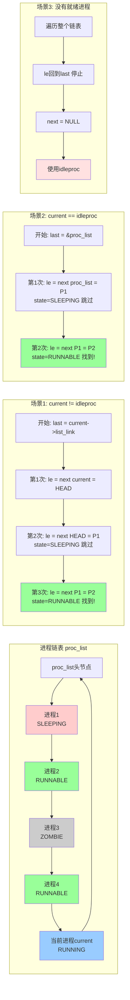
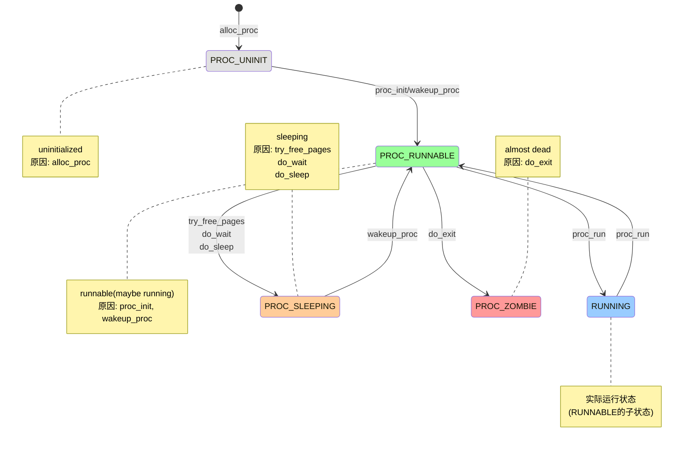

### 实验执行流程概述 

lab2和lab3完成了对内存的虚拟化，但整个控制流还是一条线串行执行。lab4将在此基础上进行CPU的虚拟化，即让ucore实现分时共享CPU，实现多条控制流能够并发执行。从某种程度上，我们可以把控制流看作是一个内核线程。本次实验将首先接触的是内核线程的管理。内核线程是一种特殊的进程，内核线程与用户进程的区别有两个：内核线程只运行在内核态而用户进程会在在用户态和内核态交替运行；所有内核线程直接使用共同的ucore内核内存空间，不需为每个内核线程维护单独的内存空间而用户进程需要维护各自的用户内存空间。从内存空间占用情况这个角度上看，我们可以把线程看作是一种共享内存空间的轻量级进程。

为了管理这些线程，必须设计用于描述线程的数据结构，即进程控制块（在这里也可叫做线程控制块）。如果要让内核线程运行，我们首先要创建内核线程对应的进程控制块，还需把这些进程控制块通过链表连在一起，便于随时进行插入，删除和查找操作等进程管理事务。这个链表就是进程控制块链表。然后在通过调度器（scheduler）来让不同的内核线程在不同的时间段占用CPU执行，调度器会按照一定策略选择哪个线程获得CPU执行权，实现对CPU的分时共享。那lab4中是如何一步一步实现这个过程的呢？

#### 内核线程创建：idleproc 与 initproc

我们还是从`kern/init/init.c`中的`kern_init`函数入手分析。在`kern_init`函数中，当完成虚拟内存的初始化工作后，就调用了`proc_init`函数（定义在`kern/process/proc.c`中），这个函数完成了进程的初始化，负责创建两个内核线程：第0个内核线程`idleproc`和第一个真正的内核线程`initproc`，这也是本次实验要完成的练习。

首先创建第0个内核进程，`idle`。`idleproc`内核线程的工作就是不停地查询，看是否有其他内核线程可以执行了，如果有，马上让调度器选择那个内核线程执行（请参考`cpu_idle`函数的实现）。所以`idleproc`内核线程是在ucore操作系统没有其他内核线程可执行的情况下才会被调用。

接下来我们对于第一个真正的内核进程进行初始化（因为`idle`进程仅仅算是“继承了”ucore的运行）。`idleproc`只是系统启动的占位线程，真正的第一个内核线程是`initproc`,通过调用`kernel_thread`函数产生。我们的目标是使用新的内核进程进行一下内核初始化的工作，在本章我们仅仅让`initproc`输出一个`Hello World`，证明我们的内核进程实现的没有问题。

#### 调度器

进程调度是多线程系统并发执行的基础，调度器是一种通过一定的调度算法、在特定的调度点上执行调度，最终完成进程切换的机制。调度的过程可以概括为：在调度点到达时，从可运行线程（`PROC_RUNNABLE`）中选择一个线程，并通过`switch_to`完成切换执行。

在lab4中，唯一的调度点位于`cpu_idle`函数中。当`idleproc`发现自己的标志位`need_resched == 1`时，它调用`schedule()`触发调度。`schedule()`函数完成的工作其实比较简单，首先在进程控制块链表中查找到一个“合适”的内核线程，所谓“合适”就是指内核线程处于`PROC_RUNNABLE`状态，如果找不到则运行`idleproc`，并通过`switch_to`函数(在后续有详细分析，有一定难度，需深入了解一下)完成具体的进程切换过程。一旦切换成功，那么`initproc`内核线程就可以通过显示字符串来表明本次实验成功。

### PCB
接下来将主要介绍了进程创建所需的重要数据结构--进程控制块
proc\_struct，以及ucore创建并执行内核线程idleproc和initproc的两种不同方式，特别是创建initproc的方式将被延续到实验五中，扩展为创建用户进程的主要方式。另外，还初步涉及了进程调度（实验六涉及并会扩展）和进程切换内容。

