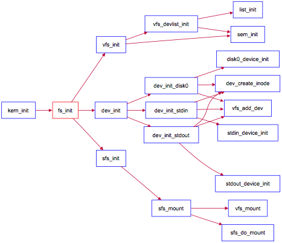

### 项目组成

#### Lab8 项目组成

```
lab8
├── CMakeLists.txt
├── giveitatry.pyq
├── kern
│   ├── debug
│   │   ├── assert.h
│   │   ├── kdebug.c
│   │   ├── kdebug.h
│   │   ├── kmonitor.c
│   │   ├── kmonitor.h
│   │   ├── panic.c
│   │   └── stab.h
│   ├── driver
│   │   ├── clock.c
│   │   ├── clock.h
│   │   ├── console.c
│   │   ├── console.h
│   │   ├── dtb.c
│   │   ├── dtb.h
│   │   ├── ide.c
│   │   ├── ide.h
│   │   ├── intr.c
│   │   ├── intr.h
│   │   ├── kbdreg.h
│   │   ├── picirq.c
│   │   ├── picirq.h
│   │   ├── ramdisk.c
│   │   └── ramdisk.h
│   ├── fs
│   │   ├── devs
│   │   │   ├── dev.c
│   │   │   ├── dev_disk0.c
│   │   │   ├── dev.h
│   │   │   ├── dev_stdin.c
│   │   │   └── dev_stdout.c
│   │   ├── file.c
│   │   ├── file.h
│   │   ├── fs.c
│   │   ├── fs.h
│   │   ├── iobuf.c
│   │   ├── iobuf.h
│   │   ├── sfs
│   │   │   ├── bitmap.c
│   │   │   ├── bitmap.h
│   │   │   ├── sfs.c
│   │   │   ├── sfs_fs.c
│   │   │   ├── sfs.h
│   │   │   ├── sfs_inode.c
│   │   │   ├── sfs_io.c
│   │   │   └── sfs_lock.c
│   │   ├── swap
│   │   │   ├── swapfs.c
│   │   │   └── swapfs.h
│   │   ├── sysfile.c
│   │   ├── sysfile.h
│   │   └── vfs
│   │       ├── inode.c
│   │       ├── inode.h
│   │       ├── vfs.c
│   │       ├── vfsdev.c
│   │       ├── vfsfile.c
│   │       ├── vfs.h
│   │       ├── vfslookup.c
│   │       └── vfspath.c
│   ├── init
│   │   ├── entry.S
│   │   └── init.c
│   ├── libs
│   │   ├── readline.c
│   │   ├── stdio.c
│   │   └── string.c
│   ├── mm
│   │   ├── default_pmm.c
│   │   ├── default_pmm.h
│   │   ├── kmalloc.c
│   │   ├── kmalloc.h
│   │   ├── memlayout.h
│   │   ├── mmu.h
│   │   ├── pmm.c
│   │   ├── pmm.h
│   │   ├── swap.c
│   │   ├── swap_fifo.c
│   │   ├── swap_fifo.h
│   │   ├── swap.h
│   │   ├── vmm.c
│   │   └── vmm.h
│   ├── process
│   │   ├── entry.S
│   │   ├── proc.c
│   │   ├── proc.h
│   │   └── switch.S
│   ├── schedule
│   │   ├── default_sched_c
│   │   ├── default_sched.h
│   │   ├── default_sched_stride.c
│   │   ├── sched.c
│   │   └── sched.h
│   ├── sync
│   │   ├── check_sync.c
│   │   ├── monitor.c
│   │   ├── monitor.h
│   │   ├── sem.c
│   │   ├── sem.h
│   │   ├── sync.h
│   │   ├── wait.c
│   │   └── wait.h
│   ├── syscall
│   │   ├── syscall.c
│   │   └── syscall.h
│   └── trap
│       ├── trap.c
│       ├── trapentry.S
│       └── trap.h
├── lab8.md
├── libs
│   ├── atomic.h
│   ├── defs.h
│   ├── dirent.h
│   ├── elf.h
│   ├── error.h
│   ├── hash.c
│   ├── list.h
│   ├── printfmt.c
│   ├── rand.c
│   ├── riscv.h
│   ├── sbi.h
│   ├── skew_heap.h
│   ├── stat.h
│   ├── stdarg.h
│   ├── stdio.h
│   ├── stdlib.h
│   ├── string.c
│   ├── string.h
│   └── unistd.h
├── Makefile
├── tools
│   ├── boot.ld
│   ├── function.mk
│   ├── gdbinit
│   ├── grade-rv64-patch.sh
│   ├── kernel.ld
│   ├── mksfs.c
│   ├── sign.c
│   ├── user.ld
│   └── vector.c
└── user
    ├── badarg.c
    ├── badsegment.c
    ├── divzero.c
    ├── exit.c
    ├── faultread.c
    ├── faultreadkernel.c
    ├── forktest.c
    ├── forktree.c
    ├── hello.c
    ├── libs
    │   ├── dir.c
    │   ├── dir.h
    │   ├── file.c
    │   ├── file.h
    │   ├── initcode.S
    │   ├── lock.h
    │   ├── panic.c
    │   ├── stdio.c
    │   ├── syscall.c
    │   ├── syscall.h
    │   ├── ulib.c
    │   ├── ulib.h
    │   └── umain.c
    ├── matrix.c
    ├── pgdir.c
    ├── priority.c
    ├── sh.c
    ├── sleep.c
    ├── sleepkill.c
    ├── softint.c
    ├── spin.c
    ├── testbss.c
    ├── waitkill.c
    └── yield.c

20 directories, 159 files
```

本次实验主要是理解`kern/fs`目录中的部分文件，并可用`user/*.c`测试所实现的`Simple
FS`文件系统是否能够正常工作。本次实验涉及到的代码包括：

* 文件系统测试用例： `user/*.c`：对文件系统的实现进行测试的测试用例；  
* 通用文件系统接口      
  `user/libs/file.[ch]` | `dir.[ch]` | `syscall.c`：与文件系统操作相关的用户库实行；    
  `kern/syscall.[ch]`：文件中包含文件系统相关的内核态系统调用接口   
  `kern/fs/sysfile.[ch]` | `file.[ch]`：通用文件系统接口和实行   
* 文件系统抽象层-VFS   
  `kern/fs/vfs/*.[ch]`：虚拟文件系统接口与实现   
* Simple FS文件系统    
  `kern/fs/sfs/*.[ch]`：`SimpleFS`文件系统实现    
* 文件系统的硬盘IO接口   
  `kern/fs/devs/dev.[ch]` | `dev_disk0.c`：`disk0`硬盘设备提供给文件系统的I/O访问接口和实现   
* 辅助工具    
  `tools/mksfs.c`：创建一个Simple FS文件系统格式的硬盘镜像。（理解此文件的实现细节对理解SFS文件系统很有帮助）   
* 对内核其它模块的扩充   
  `kern/process/proc.[ch]`：增加成员变量 `struct fs_struct *fs_struct`，用于支持进程对文件的访问；重写了 `do_execve`、`load_icode` 等函数以支持执行文件系统中的文件。     
  `kern/init/init.c`：增加调用初始化文件系统的函数 `fs_init`。    

#### Lab8文件系统初始化过程

与实验七相比，实验八增加了文件系统，并因此实现了通过文件系统来加载可执行文件到内存中运行的功能，导致对进程管理相关的实现比较大的调整。我们来简单看看文件系统是如何初始化并能在`ucore`的管理下正常工作的。

首先看看`kern_init`函数，可以发现与`lab7`相比增加了对`fs_init`函数的调用。`fs_init`函数就是文件系统初始化的总控函数，它进一步调用了虚拟文件系统初始化函数`vfs_init`，与文件相关的设备初始化函数`dev_init`和`Simple FS`文件系统的初始化函数`sfs_init`。这三个初始化函数联合在一起，协同完成了整个虚拟文件系统、`SFS`文件系统和文件系统对应的设备（键盘、串口、磁盘）的初始化工作。其函数调用关系图如下所示：

<div align="center">
    
    <p><b>文件系统初始化调用关系图</b></p>
</div>

参考上图，并结合源码分析，可大致了解到文件系统的整个初始化流程。`vfs_init`主要建立了一个`device_list`双向链表`vdev_list`，为后续具体设备（键盘、串口、磁盘）以文件的形式呈现建立查找访问通道。`dev_init`函数通过进一步调用`disk0/stdin/stdout_device_init`完成对具体设备的初始化，把它们抽象成一个设备文件，并建立对应的`inode`数据结构，最后把它们链入到`vdev_list`中。这样通过虚拟文件系统就可以方便地以文件的形式访问这些设备了。`sfs_init`是完成对`Simple FS`的初始化工作，并把此实例文件系统挂在虚拟文件系统中，从而让`ucore`的其他部分能够通过访问虚拟文件系统的接口来进一步访问到`SFS`实例文件系统。